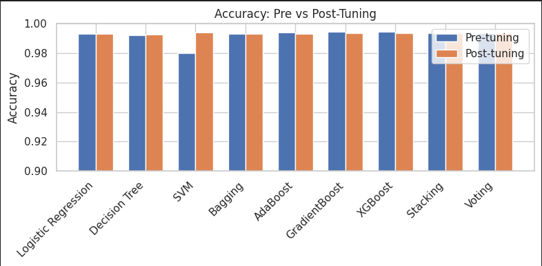

<p align="center">
  
</p>

<!-- # RTA Patient Outcome Prediction (Ensemble Machine Learning) -->


# Road Traffic Accident Patient Outcome Prediction 
<p align="center">
  
  
  
  
</p>

Ensemble machine learning pipeline for predicting **patient outcome severity** following road traffic accidents using **emergency-response and hospital records (2020–2023)**.

> Academic project — **CSE445 (Final Phase)**  
> ⚠️ Research and educational use only. Not a clinical decision support system.

---

## Overview

Road traffic accidents require rapid and accurate triage.  
This project predicts **patient outcome categories** — such as:

- Alive & Stable  
- Alive & Unstable / Critical  
- Deceased  

using accident context, patient demographics, injury details, and emergency response features.

The workflow benchmarks baseline models and then applies **ensemble learning with feature engineering and hyperparameter optimization** to achieve high multi-class classification performance.

### Key Facts

- **Dataset:** 46,190 records, 25 features  
- **Time span:** 2020–2023  
- **Pipeline:** Baseline models → Ensemble models  
- **Best model:** Gradient Boosting  
- **Best accuracy:** **~99.36%** (post-tuning)

---

## Features

- End-to-end ML workflow implemented in a single Jupyter notebook
- Data preprocessing:
  - Missing-value handling
  - Categorical encoding
  - Stratified train/validation/test split
- Feature engineering:
  - Composite **Cause_Reason** contextual feature
- Model benchmarking:
  - Logistic Regression
  - Decision Tree
  - Support Vector Machine (SVM)
- Ensemble models:
  - Bagging
  - AdaBoost
  - Gradient Boosting
  - XGBoost
  - Voting Classifier
  - Stacking Classifier
- Hyperparameter tuning using `RandomizedSearchCV`
- Evaluation:
  - Accuracy, Precision, Recall, F1-score
  - Confusion matrices
  - Learning curves
- Final academic report included in `reports/`

---

## Tech Stack

- **Language:** Python 3
- **Environment:** Jupyter Notebook / Google Colab
- **Libraries:**
  - `pandas`, `numpy`
  - `scikit-learn`
  - `xgboost`
  - `matplotlib`, `seaborn`
  - `scipy`


## Repository Structure

```text
rta-patient-outcome-prediction-ensemble-ml/
├─ notebooks/
│  └─ Final_Phase_Notebook.ipynb
├─ reports/
│  ├─ FINAL_PHASE_REPORT.pdf
│  └─ FINAL_PHASE_REPORT.docx
├─ data/
│  ├─ .gitkeep
│  └─ README.md
├─ assets/
│  └─ screenshots/
│     └─ .gitkeep
├─ .gitignore
├─ LICENSE
└─ README.md
```
## Dataset

- ~46,000 rows  
- 25 features  
- **Target column:** `PatientStatus`  
- Combination of numerical and categorical attributes

### Example Features

- `Age`, `Gender`, `EducationTitle`
- `EmergencyArea`, `ResponseTime`
- `Cause`, `Reason`, `InjuryType`
- Vehicle counts and accident context variables

### Local Dataset Placement

1. Place the dataset file inside the `data/` directory  
   ```data/RTA-DATA-2020-TO-JULY-2023.xlsx```

2. Update the dataset loading cell in the notebook:
  ``` import pandas as pd  
  df = pd.read_excel("data/RTA-DATA-2020-TO-JULY-2023.xlsx")
```

> Dataset is **not included** in this repository due to academic and privacy constraints.

---

## Setup & Installation (Local)
```
python -m venv .venv  
source .venv/bin/activate  (Windows: .venv\Scripts\activate)  
pip install --upgrade pip  
pip install pandas numpy scikit-learn xgboost matplotlib seaborn scipy jupyter  
```
*Optional: add `requirements.txt` later for reproducibility.*

---

## Usage

### Option A — Google Colab

1. Open `notebooks/Final_Phase_Notebook.ipynb` in Google Colab  
2. Upload the dataset file when prompted  
3. Run all cells sequentially  

### Option B — Local Execution

1. Place the dataset file in the `data/` directory  
2. Replace Colab upload logic with a local file path  
3. Run Jupyter Notebook:
   ```jupyter notebook```

---

## Methodology Summary

This project predicts **patient outcome status** from road traffic accident records using a complete ML pipeline:

- **Data Preparation**
  - Load dataset
  - Handle missing values
  - Encode categorical variables
  - Remove duplicates (if present)

- **Feature Engineering**
  - Construct a composite contextual feature:
    - `Cause_Reason = Cause + "_" + Reason + "_" + EmergencyArea`

- **Model Training**
  - Baseline models:
    - Logistic Regression
    - Decision Tree
    - Support Vector Machine (SVM)
  - Ensemble models:
    - Bagging
    - AdaBoost
    - Gradient Boosting
    - XGBoost
    - Voting Classifier
    - Stacking Classifier

- **Hyperparameter Optimization**
  - Randomized hyperparameter search for each model family

- **Evaluation**
  - Accuracy, Precision, Recall, F1-score
  - Confusion matrices
  - Pre- vs post-tuning performance comparison

---

## Results

### Post-Tuning Accuracy (Leaderboard)

| Rank | Model               | Post-Accuracy | Accuracy (%) |
|-----:|---------------------|--------------:|-------------:|
| 1    | GradientBoost       | 0.993609      | 99.3609%     |
| 2    | Stacking            | 0.993501      | 99.3501%     |
| 3    | Voting              | 0.993393      | 99.3393%     |
| 4    | XGBoost             | 0.993393      | 99.3393%     |
| 5    | Bagging             | 0.993176      | 99.3176%     |
| 6    | AdaBoost            | 0.993068      | 99.3068%     |
| 7    | Logistic Regression | 0.992959      | 99.2959%     |
| 8    | Decision Tree       | 0.992851      | 99.2851%     |

### Best Parameters (Post-Tuning)

> Some parameter dictionaries are truncated in the notebook display; keep them as-is unless you export full configs.

| Model               | Best Parameters |
|--------------------|-----------------|
| Logistic Regression | `{'C': 1}` |
| Decision Tree       | `{'max_depth': 10, 'min_samples_leaf': 5, 'min_...}` |
| SVM                 | `{'C': 1, 'gamma': 'scale', 'kernel': 'linear'}` |
| Bagging             | `{'max_features': 0.5779972601681014, 'max_samp...}` |
| AdaBoost            | `{'learning_rate': 0.3845401188473625, 'n_estim...}` |
| GradientBoost       | `{'learning_rate': 0.05666566321361543, 'max_de...}` |
| XGBoost             | `{'colsample_bytree': 0.855670976374325, 'learn...}` |
| Stacking            | `{'estimators': ['lr', 'dt', 'svm'], 'final_est...}` |
| Voting              | `{'voting': 'soft'}` |

### Accuracy Comparison (Pre vs Post Tuning)



---

## Limitations

- Dataset is not publicly available
- Results depend on data split strategy and random seed
- Academic project — **not validated for clinical decision-making**

---

## Roadmap

- [ ] Add `requirements.txt`
- [ ] Fix and document random seeds
- [ ] Export full hyperparameter configurations
- [ ] Add inference pipeline (model save/load)

---

## License

MIT License

---

## Acknowledgements

- **CSE445** — course context  
- Open-source ML ecosystem:
  - scikit-learn
  - XGBoost

---

## Contact
- [**Motasim Abid**](https://github.com/MotasimAbid19) — Motasimabid19@gmail.com  
- [**Naima Zaman Roshni**](https://github.com/NaimaRoshni) — naima.zaman@northsouth.edu
